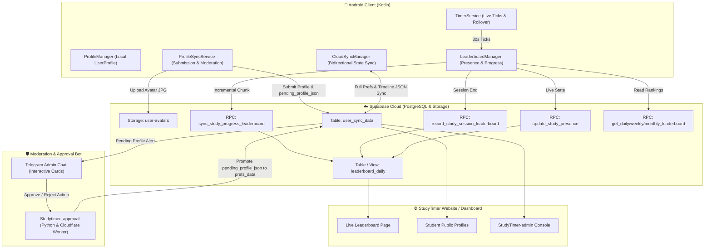
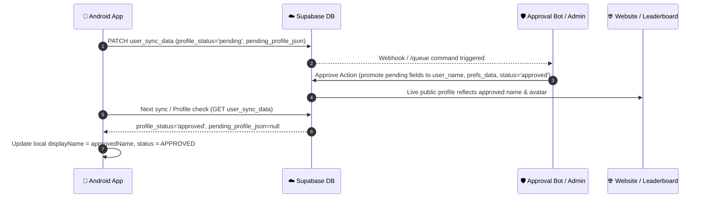
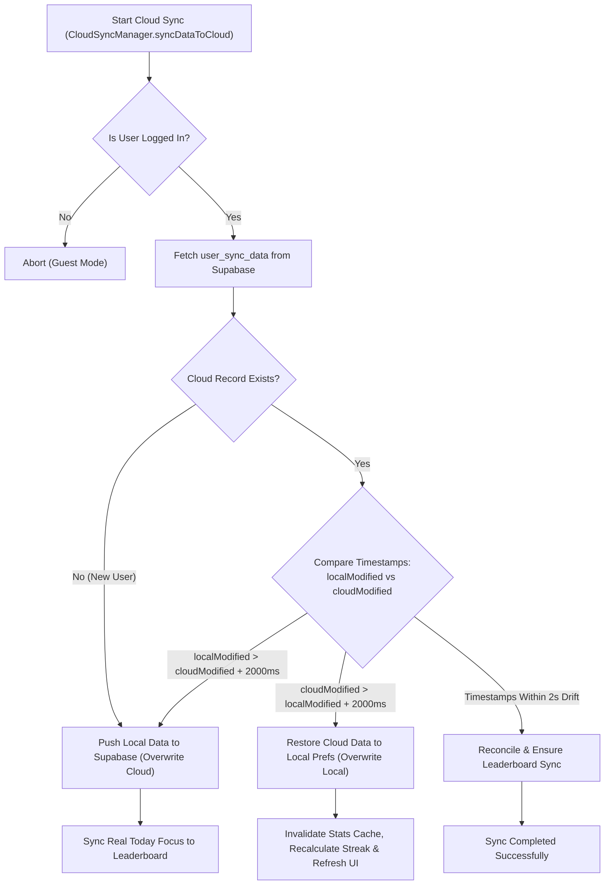

# StudyTimer: Profile Sync, Leaderboard Sync & Cloud Architecture Specification

> **Version:** 2.4.0  
> **Target Audience:** Backend Developers, Web Platform Engineers, AI Verification Agents  
> **System Scope:** StudyTimer Android App, Supabase Database & RPCs, Cloudflare Workers, Moderation Engine, Web Dashboard

---

## 1. Executive System Architecture

StudyTimer utilizes an **offline-first, cloud-reconciled architecture** built on top of Supabase PostgreSQL, Storage, and Edge RPCs. The architecture ensures that offline timer sessions are preserved locally and seamlessly synced to the cloud leaderboard and user profile database upon reconnection.



---

## 2. Profile Management & Moderation Pipeline

### 2.1 Local User Profile Data Model (`UserProfile`)
Located in [`ProfileManager.kt`](file:///d:/Download/My%20app/Studytimer%20main/StudyTimer-app/app/src/main/java/com/madeby/JAI/ProfileManager.kt):

| Field | Type | Description |
| :--- | :--- | :--- |
| `displayName` | `String` | Currently active public display name (e.g. "Arjun Sharma") |
| `lastApprovedDisplayName` | `String?` | Fallback name displayed publicly while an edit is pending approval |
| `pendingDisplayName` | `String?` | The new name currently awaiting admin approval |
| `bio` | `String` | Student bio / mood status (max 150 chars) |
| `targetExam` | `String` | Target competitive exam (e.g. "JEE Advanced", "NEET", "UPSC", "Self-Study") |
| `dailyGoalMinutes` | `Int` | Configured daily focus goal in minutes (15 to 960) |
| `avatarUrl` | `String` | Public URL (HTTPS) or emoji preset identifier |
| `lastApprovedAvatar` | `String?` | Fallback avatar URL while a new photo is in review |
| `avatarPresetId` | `String` | Preset ID (e.g. `avatar_scholar`, `avatar_zen`, `avatar_fire`) |
| `moderationStatus` | `ModerationStatus` | `APPROVED`, `PENDING_APPROVAL`, `REJECTED`, `NONE` |
| `rejectionReason` | `String?` | Optional explanation if admin rejected the edit |
| `updatedAt` | `Long` | Local timestamp in milliseconds |

---

### 2.2 Profile Edit Submission Lifecycle (`ProfileSyncService.kt`)

1. **Pre-Sanitization & Local Profanity Filter:**
   - Runs [`ProfanityFilter.checkName(displayName)`](file:///d:/Download/My%20app/Studytimer%20main/StudyTimer-app/app/src/main/java/com/madeby/JAI/ProfanityFilter.kt) checking English, Hindi, and Hinglish offensive terms.
   - If rejected locally, UI immediately alerts user without network transmission.

2. **Avatar Processing & Storage Upload:**
   - If user selected a custom photo from gallery: image is cropped, compressed to 512x512 WebP/JPEG, and uploaded via HTTP PUT/POST to Supabase Storage:
     `https://<SUPABASE_URL>/storage/v1/object/user-avatars/<user_id>/avatar_<timestamp>.jpg`
   - Returns public CDN URL:
     `https://<SUPABASE_URL>/storage/v1/object/public/user-avatars/<user_id>/avatar_<timestamp>.jpg`

3. **Cloud Submission (`user_sync_data`):**
   - If the user modified their display name or uploaded a new avatar photo, their cloud state transitions to `profile_status = "pending"`.
   - The pending changes are staged into `pending_profile_json`:
     ```json
     {
       "display_name": "New Name",
       "displayName": "New Name",
       "bio": "Targeting AIR 100",
       "mood": "Targeting AIR 100",
       "targetExam": "JEE Advanced 2027",
       "exam_target": "JEE Advanced 2027",
       "avatar_preset": "avatar_default",
       "avatar_url": "https://<SUPABASE_URL>/storage/v1/object/public/user-avatars/usr_123/avatar_171000.jpg",
       "photo_changed": true,
       "submitted_at": 1711756800000
     }
     ```
   - Sent via HTTP PATCH to `https://<SUPABASE_URL>/rest/v1/user_sync_data?user_id=eq.<user_id>`:
     ```json
     {
       "profile_status": "pending",
       "pending_profile_json": "<JSON_STRING>",
       "profile_image_uri": "<AVATAR_URL>",
       "updated_at": 1711756800000
     }
     ```

4. **Telegram Notification Dispatch:**
   - An interactive Telegram card is dispatched to Admin Chat via Bot `8755792560:AAFrTNyOjveVTV9vtRgwVD6tkNMwfRBDG2k` with inline buttons `[✅ Approve]` and `[❌ Reject]`.

---

### 2.3 Profile Approval & Resolution Workflow



- **Approval Logic in [`moderation_bot.py`](file:///d:/Download/My%20app/Studytimer_approval/moderation_bot.py):**
  When approved:
  1. `profile_status` set to `'approved'`.
  2. `user_name` set to `pending_data['display_name']`.
  3. `profile_image_uri` set to `pending_data['avatar_url']`.
  4. `prefs_data.__user_profile__.displayName` updated to new name.
  5. `pending_profile_json` cleared to `null`.
  6. Historical entries in `leaderboard_daily` and `study_sessions` for that `user_id` are updated with the new `user_name`.

---

## 3. Leaderboard & Study Presence Real-Time Sync

### 3.1 Gating Rules & User Controls
- **Authentication Required:** Guest users (`isLoggedIn == false` or `user_id.startsWith("guest_")`) **never** publish to the cloud leaderboard.
- **Opt-in Participation:** Controlled by `leaderboard_participate` (Boolean in SharedPreferences). If `false`, no leaderboard progress is sent.
- **Live Status Sharing:** Controlled by `leaderboard_share_live_status`. If `false`, the user appears offline with no subject/color broadcasted.
- **Sanity Hard Caps:**
  - `MAX_DAILY_LEADERBOARD_SECONDS = 57,600` (16 hours/day hard cap).
  - Single progress increment clamped to `14,400s` (4 hours max per request).
  - Continuous study anti-cheat check triggered after `3.5 hours` of uninterrupted study.

---

### 3.2 Leaderboard RPC Endpoints & Payload Signatures

#### A. Live Presence Broadcast (`update_study_presence`)
Called every 30 seconds or whenever timer state toggles (Study / Break / Paused / Idle).

- **Endpoint:** `POST /rest/v1/rpc/update_study_presence`
- **Request Headers:**
  ```http
  apikey: <SUPABASE_ANON_KEY>
  Authorization: Bearer <SUPABASE_ANON_KEY>
  Content-Type: application/json
  ```
- **Payload Schema:**
  ```json
  {
    "p_user_id": "9b1deb4d-3b7d-4bad-9bdd-2b0d7b3dcb6d",
    "p_user_name": "Arjun Sharma",
    "p_avatar_url": "https://.../avatar.jpg",
    "p_is_studying": true,
    "p_current_subject": "Physics - Electromagnetism",
    "p_subject_color": "#3B82F6",
    "p_study_date": "2026-09-29"
  }
  ```

---

#### B. Incremental Progress Sync (`sync_study_progress_leaderboard`)
Called periodically while timer is ticking (every 30 seconds accumulated) to push increments without losing progress on app crash or device kill.

- **Endpoint:** `POST /rest/v1/rpc/sync_study_progress_leaderboard`
- **Payload Schema:**
  ```json
  {
    "p_user_id": "9b1deb4d-3b7d-4bad-9bdd-2b0d7b3dcb6d",
    "p_user_name": "Arjun Sharma",
    "p_avatar_url": "https://.../avatar.jpg",
    "p_incremental_seconds": 30,
    "p_is_studying": true,
    "p_current_subject": "Mathematics - Calculus",
    "p_subject_color": "#10B981",
    "p_study_date": "2026-09-29"
  }
  ```
- **SQL Logic:**
  - Adds `p_incremental_seconds` to the user's daily record for `p_study_date`.
  - Caps the result at `57600` seconds (16 hours).
  - Updates `last_active_at = NOW()`.

---

#### C. Session Completion Sync (`record_study_session_leaderboard`)
Called when a study session stops or when manual adjustment syncs to leaderboard.

- **Endpoint:** `POST /rest/v1/rpc/record_study_session_leaderboard`
- **Payload Schema:**
  ```json
  {
    "p_user_id": "9b1deb4d-3b7d-4bad-9bdd-2b0d7b3dcb6d",
    "p_user_name": "Arjun Sharma",
    "p_avatar_url": "https://.../avatar.jpg",
    "p_duration_seconds": 1800,
    "p_subject": "Organic Chemistry",
    "p_subject_color": "#F59E0B",
    "p_study_date": "2026-09-29"
  }
  ```

---

#### D. Manual Override Sync (`override_daily_focus_total`)
Called when a student or developer uses Adjust Time Dialog and syncs to leaderboard.

- **Endpoint:** `POST /rest/v1/rpc/override_daily_focus_total`
- **Payload Schema:**
  ```json
  {
    "p_user_id": "9b1deb4d-3b7d-4bad-9bdd-2b0d7b3dcb6d",
    "p_user_name": "Arjun Sharma",
    "p_avatar_url": "https://.../avatar.jpg",
    "p_total_seconds": 7200,
    "p_subject": "Physics",
    "p_subject_color": "#3B82F6",
    "p_study_date": "2026-09-29"
  }
  ```

---

### 3.3 Fetching Leaderboard Rankings

Leaderboard queries are split into three time buckets:
1. **Daily:** `get_daily_leaderboard(p_date: 'YYYY-MM-DD', p_limit: 50)`
2. **Weekly:** `get_weekly_leaderboard(p_start_date: 'YYYY-MM-DD', p_end_date: 'YYYY-MM-DD', p_limit: 50)`
3. **Monthly:** `get_monthly_leaderboard(p_start_date: 'YYYY-MM-DD', p_end_date: 'YYYY-MM-DD', p_limit: 50)`

**Response Item Schema:**
```json
[
  {
    "rank": 1,
    "user_id": "9b1deb4d-3b7d-4bad-9bdd-2b0d7b3dcb6d",
    "user_name": "Arjun Sharma",
    "avatar_url": "https://.../avatar.jpg",
    "total_seconds": 28800,
    "is_studying": true,
    "current_subject": "Organic Chemistry",
    "subject_color": "#F59E0B",
    "last_active_at": "2026-09-29T16:45:00Z"
  }
]
```

**Profile Enrichment:**
The Android client batches a supplementary query to fetch student bios and exam targets:
```http
GET /rest/v1/user_sync_data?user_id=in.(uid1,uid2,...)&select=user_id,prefs_data,pending_profile_json
```
This populates the student's `bio` and `targetExam` tags in the leaderboard UI.

---

## 4. Full Cloud Backup & Conflict Resolution (`CloudSyncManager.kt`)

### 4.1 Database Table Structure: `user_sync_data`

| Column | Type | Description |
| :--- | :--- | :--- |
| `user_id` | `TEXT (PK)` | Supabase Auth UUID |
| `user_email` | `TEXT` | Google / Supabase Email address |
| `user_name` | `TEXT` | Public display name |
| `profile_image_uri` | `TEXT` | Public avatar image URI |
| `profile_status` | `TEXT` | `approved`, `pending`, `rejected`, `banned` |
| `pending_profile_json` | `TEXT` | JSON payload of pending profile edits |
| `prefs_data` | `TEXT` | Serialized JSON containing all SharedPreferences keys |
| `timeline_data` | `TEXT` | Serialized JSON array of all TimelineLogger entries |
| `subjects_data` | `TEXT` | Serialized JSON of custom subjects & color mappings |
| `history_json` | `TEXT` | Serialized JSON of past study sessions date-by-date |
| `updated_at` | `BIGINT` | Last modified epoch timestamp in milliseconds |
| `client_version` | `TEXT` | App version code & string |
| `device_model` | `TEXT` | Android hardware device model |

---

### 4.2 Bidirectional Conflict Resolution Algorithm



---

## 5. Website & Agent Verification Checklist

When verifying or implementing sync on the Web Dashboard / Backend, confirm the following:

- [ ] **Table Constraints:** `user_sync_data` must have `user_id` as primary key with RLS (Row Level Security) allowing authenticated users to read/update their own row.
- [ ] **16-Hour Sanity Cap:** Ensure all RPC functions (`sync_study_progress_leaderboard`, `record_study_session_leaderboard`, `override_daily_focus_total`) enforce `LEAST(total_seconds, 57600)`.
- [ ] **Midnight Rollover:** Ensure daily leaderboard queries group by `study_date` (local calendar date format `YYYY-MM-DD`).
- [ ] **Pending Moderation Queue:** The website profile view must show `user_name` (last approved name) and fallback avatar until `profile_status == 'approved'`.
- [ ] **Presence Timeout:** Students with `is_studying = true` whose `last_active_at` is older than 5 minutes should be displayed as offline in the Web UI.
- [ ] **UTF-8 Support:** Display names, bios, and subject titles support Hindi, emojis, and special mathematical characters.
